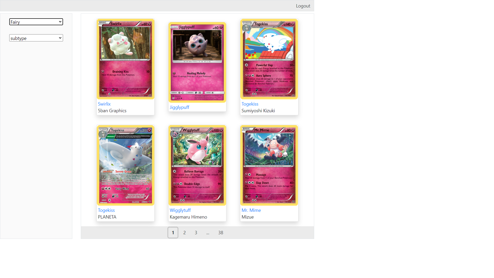
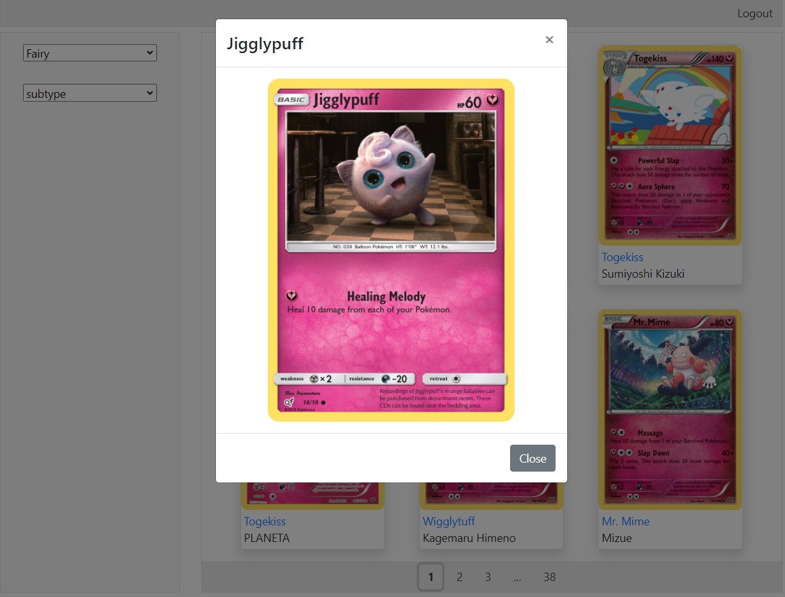
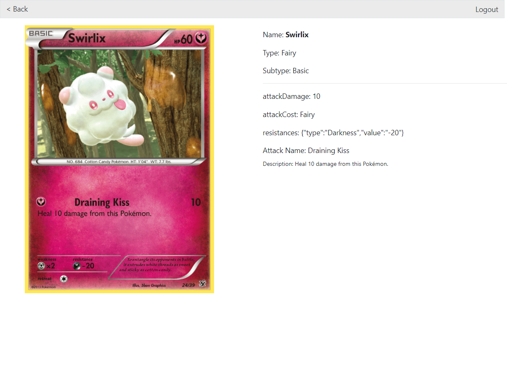

  

  <h2 align="center">Стажировка
  Frontend</h2>

  

    
Ноябрь 2020

  

# Тестовое задание на стажировку в компанию KODE

## Состоит из двух частей:

1. Функция поиска значения в объекте по заданному пути ключей.
2. Приложение для просмотра распределенных по категориям карточек с Покемонами.

### Первое задание:

Функция находиться в [файле](https://github.com/Eyvgeniy/test-project-pokemon-api/blob/main/src/utils/getObjectProperty.js). Спроектирована по методологии TDD, время на реализацию 20 минут.

### Второе задание:

Используется публичное API – https://pokemontcg.io/.

#### Стэк

- [Create React App](https://create-react-app.dev/)
- [Function components + React Hooks](https://reactjs.org/docs/hooks-state.html#hooks-and-function-components)
- [React-router](https://reactrouter.com/web/api/Route/render-func)
- [Bootstarp](https://getbootstrap.com/)

Проект размещен на [Github Pages](https://eyvgeniy.github.io/test-project-pokemon-api/#/)

- Доступ в приложение по ключам:
  - Логин — `kode@kode.ru`
  - Пароль — `Enk0deng`
  - SMS Код - `123456`

Из задач со звездочкой выполнено:

- [x] Пагинация карточек.
- [x] Любые анимации интерфейса
- [x] Быстрый просмотр покемона в модальном окне по клику на карточку
- [x] Сохранение сессии авторизованного пользователя после закрытия вкладки браузера. Например, через local storage браузера
- [x] Адаптивный дизайн

Скрины итогового приложения:

